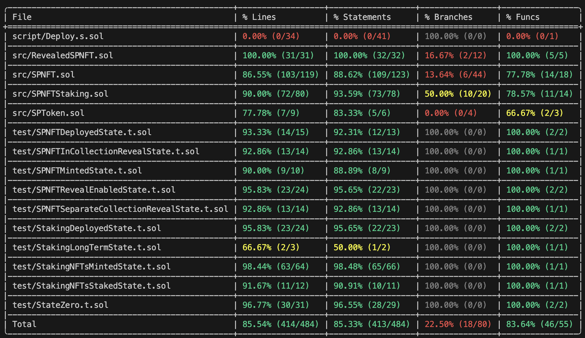

# SP NFT Project

This project implements a SP NFT (ERC-721) with different metadata revealing approaches. The solution leverages Chainlink for random number generation and allows for two distinct revealing approaches, with staking functionality for revealed NFTs.

## Project Structure

- `SPNFT.sol` - Base SP NFT contract with support for both in-collection and separate collection reveals
- `RevealedSPNFT.sol` - Contract for revealed NFTs in the separate collection approach
- `SPToken.sol` - ERC20 token for staking rewards
- `SPNFTStaking.sol` - Contract for staking revealed NFTs from either collection

## Features

1. **Two Revealing Approaches:**
   - In-Collection Revealing: The SP NFT and the revealed SP NFT reside in the same ERC-721 contract
   - Separate Collection Revealing: The SP NFT and the revealed SP NFT are stored in separate ERC-721 contracts

2. **User-Initiated Revealing:**
   - End users can request reveals for their own tokens
   - Operators can perform batch reveals
   - Only revealed tokens can be staked

3. **On-Chain Metadata:**
   - All metadata are stored on-chain
   - Metadata is generated on the fly within the tokenURI() function
   - Before reveal, all tokens share the same "mystery box" metadata
   - After reveal, each token has unique metadata based on Chainlink randomness

4. **Chainlink Integration:**
   - Uses Chainlink VRF for secure random number generation
   - Randomness determines token attributes and appearance
   - Each token gets unique randomness for trait distribution

5. **Purchase and Return:**
   - Buy SP NFT with Ether
   - Returns excessive funds if the final mint price is lower than the purchase price

6. **Staking and Rewards:**
   - Stake revealed NFTs from either collection to earn 5% APY in ERC20 tokens
   - Unified staking interface handles both collections
   - Claim rewards at any time without unstaking
   - Unstake to withdraw NFTs and claim rewards

## Prerequisites

- [Foundry](https://book.getfoundry.sh/getting-started/installation)
- An Ethereum wallet with Sepolia ETH for deployment
- A Chainlink VRF subscription on Sepolia

## Setup
 
1. Clone the repository:
   ```bash
   git clone <repository-url>
   cd sp-nft-project
   ```

2. Install dependencies:
   ```bash
   forge install
   ```

3. Set up environment variables:
   - Create a `.env` file with the following variables:
     ```
     PRIVATE_KEY=your_private_key
     SEPOLIA_RPC_URL=your_sepolia_rpc_url
     ETHERSCAN_API_KEY=your_etherscan_api_key
     ```

   - Alternatively, encrypt your private key with `cast` for better security 
     ```
     cast wallet import --private-key $PRIVATE_KEY --password $PASSWORD 
     export KEYSTORE_FILE=./path-to-your-keystore-file
     export KEYSTORE_PASSWORD=mypassword123
     ```

4. Configure your Chainlink VRF:
   - Go to [Chainlink VRF Subscription Manager](https://vrf.chain.link/) and create a subscription
   - Fund your subscription with LINK tokens
   - Add the consumer contract address (after deployment)
   - Update the `SUBSCRIPTION_ID` in the deployment script

## Deployment

1. Deploy the contracts to Sepolia:
   ```bash
   source .env
   forge script script/Deploy.s.sol:DeployScript --rpc-url $SEPOLIA_RPC_URL --broadcast --verify
   ```

   Or if you are using an encrypted private key, you can use the following command:
   ```bash
   forge script script/Deploy.s.sol:DeployScript --keystore $KEYSTORE_FILE --password $KEYSTORE_PASSWORD --rpc-url $SEPOLIA_RPC_URL --etherscan-api-key $ETHERSCAN_API_KEY --broadcast --verify
   ```

   You may need to add the `--slow` flag if you encouter issues relating to: `error code -32000: future transaction tries to replace pending`

2. After deployment, add your SPNFT contract address as a consumer in your Chainlink VRF subscription.


## Usage

### Minting an NFT

To mint an NFT, call the `mint` function on the SPNFT contract with the required ETH value.

### Setting Reveal Type

As the contract owner, you can set the reveal type before revealing starts:
1. Call `setRevealType(0)` for in-collection revealing
2. Call `setRevealType(1)` for separate collection revealing (make sure you've set the revealed collection address)

### Requesting Reveal--etherscan-api-key

1. Enable revealing by calling `setRevealEnabled(true)`
2. As a token owner, call `requestReveal(tokenId)` to reveal your token
3. As an operator, call `batchRequestReveal([tokenIds])` to reveal multiple tokens
4. Once the VRF callback is fulfilled, the tokens will be revealed with random attributes

### Staking NFTs

1. Make sure your NFT is revealed (either in the original or revealed collection)
2. Approve the staking contract to transfer your NFT
3. Call `stake(nftType, tokenId)` on the staking contract:
   - Use `NFTType.Original (0)` for in-collection revealed tokens
   - Use `NFTType.Revealed (1)` for separate collection tokens
4. To claim rewards without unstaking, call `claimRewards(nftType, tokenId)`
5. To unstake and claim rewards, call `unstake(nftType, tokenId)`

## Contract Addresses (Sepolia)

- SPNFT: [0x3eE7117a84EE550ee080C60724fFFe624CaDE6B8]
- RevealedSPNFT: [0x88b40aba32b4915C82E91d69AB7ea9C97202cf43]
- SPToken: [0x442EBd873911C12879Cb4664c1922207699F0963]
- SPNFTStaking: [0xf585dC1E362F32F114Bbb3a2BfB039AEA06d3c42]

## Security Considerations

- All contracts use OpenZeppelin's secure implementations where possible
- ReentrancyGuard is used to prevent reentrancy attacks in critical functions
- Ownership controls ensure only authorized addresses can perform sensitive operations
- Input validation ensures data integrity
- Only revealed tokens can be staked

## Gas Optimizations

- Unified staking interface reduces duplicate code
- Type-based routing for different NFT collections
- Efficient storage layouts for staking information
- Batch reveal capability for operators
- Minimal storage usage for token tracking

## Test Coverage 

To generate a test coverage, run `forge coverage --report lcov`. 

For detailed test coverage reports, see the `coverage` directory. 

Here is a quick summary for this repository for reference: 

 